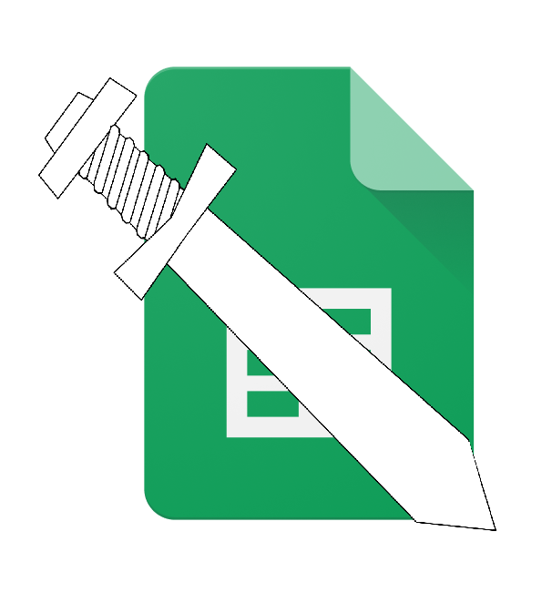

<a id="readme-top"></a>

<br />
<div align="center">
  <a href="">
    
  </a>

  <h3 align="center">Excalibur</h3>

  <p align="center">
    Excalibur is an event management Discord bot written in Node.js that leverages the Google API. It integrates seamlessly with Google Sheets to provide robust reminder functionalities.
  </p>
</div>

<details>
  <summary>Table of Contents</summary>
  <ol>
    <li>
      <a href="#about-the-project">About The Project</a>
      <ul>
        <li><a href="#built-with">Built With</a></li>
      </ul>
    </li>
    <li>
      <a href="#getting-started">Getting Started</a>
      <ul>
        <li><a href="#prerequisites">Prerequisites</a></li>
        <li><a href="#installation">Installation</a></li>
      </ul>
    </li>
    <li><a href="#usage">Usage</a></li>
    <li><a href="#roadmap">Roadmap</a></li>
    <li><a href="#contributing">Contributing</a></li>
    <li><a href="#license">License</a></li>
    <li><a href="#contact">Contact</a></li>
    <li><a href="#acknowledgments">Acknowledgments</a></li>
  </ol>
</details>

<p align="right">(<a href="#readme-top">back to top</a>)</p>

This guide walks you through the process of setting up the Excalibur Discord bot. Follow the steps carefully to ensure the bot is configured correctly and works seamlessly with Google Sheets and Discord.

Prerequisites

Before starting, ensure you have the following:
- A Google Cloud account
- A Discord account
- Node.js installed on your machine

# Setup

## 1. Clone the Repository

Start by cloning the repository to your local machine:
```
git clone git@github.com:C-Teo/excalibur.git
```

## 2. Install Dependencies

Navigate to the root directory of the project and install all required modules:
```
npm install
```

## 3. Set Up Google Sheets API

To enable the bot to interact with Google Sheets, follow these steps:
1. Go to the Google Cloud Console (https://console.cloud.google.com/).
2. Create a new project by selecting **Select a Project** -> **New Project**.
3. Once your project is created, go to **API & Services** and click on **Enable API & Services**.
4. Search for **Google Sheets API** and enable it.

## 4. Create Service Account Credentials
1. On the Google Sheets API page, click Create Credentials.
2. Select Service Account and choose Google Sheets API.
3. Check Application Data and provide a name for the service account.
4. Click Agree and Continue, then grant the service account IAM Editor access to the project.
5. Click Done once the credentials are created.

## 5. Download Service Account Key
1. In the Credentials tab, click on the service account you just created.
2. Under Keys, click Add Key, then select JSON.
3. Name the file secrets.json.
4. Create a folder named config in the root directory of the project and place the secrets.json file inside it.

## 6. Share Google Sheet with Service Account
1. Open your Google Sheet.
2. Share it with the service account email, which can be found in the Credentials tab of the Google Sheets API page.
3. Give the service account view access (edit permissions are not needed).
> Note: If you're having trouble with steps 3-6, refer to this video guide (https://youtu.be/zCEJurLGFRk?si=IhRPMxeZN3T2UXCA) (time: 1:56 - 8:30).

## 7. Set Up Discord Bot
1. Go to the Discord Developer Portal.
2. Under Applications, create a new application and name it as desired.
3. Go to the OAuth2 section and select Bot.
4. Under Bot Permissions, give the bot all necessary text permissions.
5. Enable Server Member Intent on the bot page.

## 8. Create the .env File
In the root directory of the project, create a .env file with the following content:
```
DISCORD_TOKEN=""
CLIENT_ID=""
BOT_ID=
```
- DISCORD_TOKEN: The bot token you get from the Discord Developer Portal.
- CLIENT_ID: The application ID found under General Info in the Discord Developer Portal.
-  BOT_ID: The bot ID found under the Bot section in the Discord Developer Portal.

## 9. Configure Sheet URL and Range
In the .env file, set the following values:
- SHEET_URL: The URL of your Google Sheet.
- SHEET_RANGE: The range you wish to interact with (e.g., Sheet1!A1:B10).

## 10. Deploy Commands
Run the following command to deploy your Discord bot commands:
```
node src/utils/deploy-commands.js
```

11. Start the Bot
Once everything is set up, run the bot:
```
node src/index.js
```

# Why You Need to Set Up the Bot Yourself

You might wonder why you need to run the bot on your own server instead of using a pre-configured one. The reason is that a service account provides several benefits:
- Persistent access without the need for user login.
- Server-side authentication without manual OAuth token refresh.
- Ideal for background and automated tasks.

Since the bot requires access to your Google Sheets via a service account, it would be insecure to have someone else manage your credentials. Running the bot yourself ensures that your credentials remain secure.

## Troubleshooting
If you encounter any issues, ensure that all steps are followed carefully, particularly the configuration of Google Sheets API and Discord bot permissions.

### Built With

* [![Node.js][Node.js]][Node-url]
* [![Google API][Google-API]][Google-API-url]
* [![Discord.js][Discord.js]][Discord.js-url]

<p align="right">(<a href="#readme-top">back to top</a>)</p>

## Usage

Use this space to show useful examples of how a project can be used. Additional screenshots, code examples and demos work well in this space. You may also link to more resources.

_For more examples, please refer to the [Documentation](https://example.com)_

<p align="right">(<a href="#readme-top">back to top</a>)</p>

## TODO

- [ ] Set up Dynamic GSheet Configuration

<p align="right">(<a href="#readme-top">back to top</a>)</p>

<!-- CONTRIBUTING -->
## Contributing

Contributions are what make the open source community such an amazing place to learn, inspire, and create. Any contributions you make are **greatly appreciated**.

If you have a suggestion that would make this better, please fork the repo and create a pull request. You can also simply open an issue with the tag "enhancement".
Don't forget to give the project a star! Thanks again!

1. Fork the Project
2. Create your Feature Branch (`git checkout -b feature/AmazingFeature`)
3. Commit your Changes (`git commit -m 'Add some AmazingFeature'`)
4. Push to the Branch (`git push origin feature/AmazingFeature`)
5. Open a Pull Request

## License

Distributed under the MIT License. See `LICENSE.txt` for more information.

<p align="right">(<a href="#readme-top">back to top</a>)</p>

[Node.js]: https://img.shields.io/badge/Node.js-339933?style=for-the-badge&logo=node.js&logoColor=white
[Node-url]: https://nodejs.org/
[Google-API]: https://img.shields.io/badge/Google%20API-4285F4?style=for-the-badge&logo=google&logoColor=white
[Google-API-url]: https://cloud.google.com/apis
[Discord.js]: https://img.shields.io/badge/Discord.js-5865F2?style=for-the-badge&logo=discord&logoColor=white
[Discord.js-url]: https://discord.js.org/
